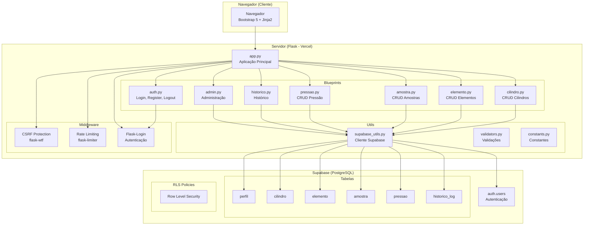
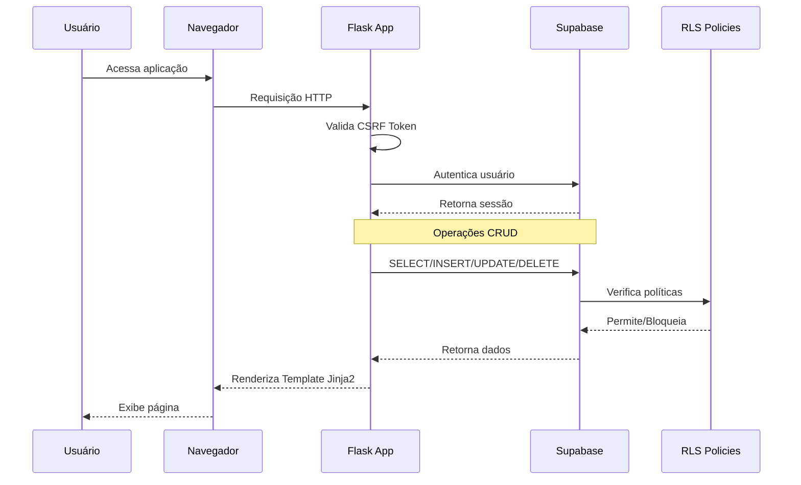
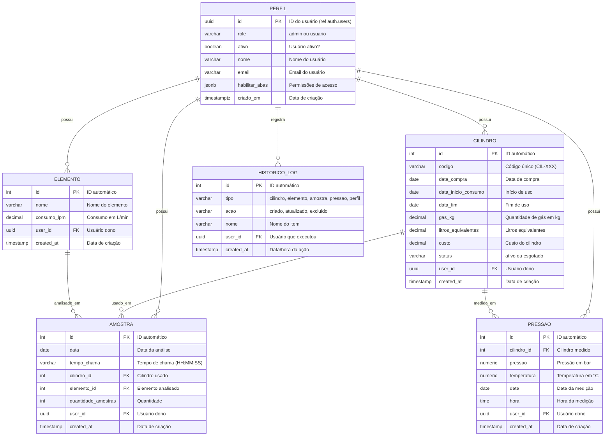
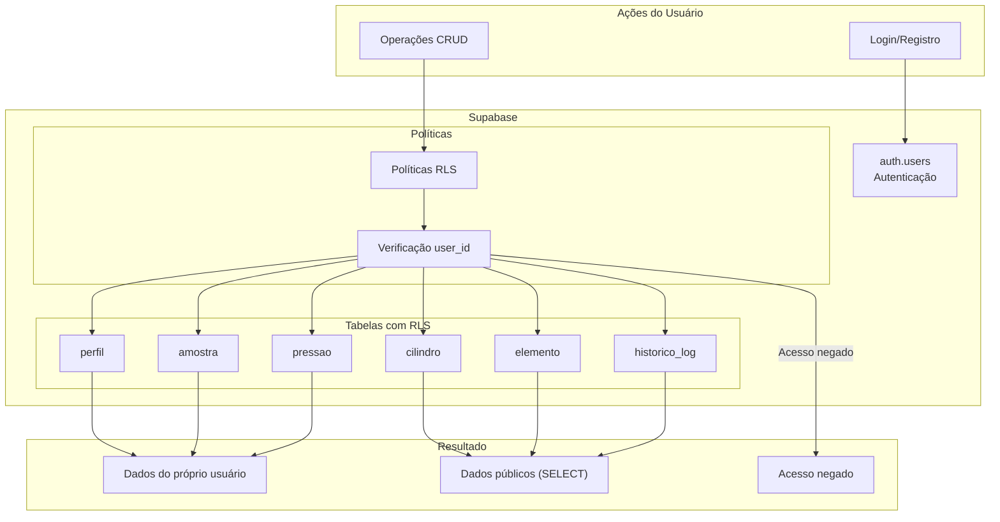

# LabGas Manager

**Versão: 2.6.19** (Branch: master)

Dashboard para gestão de cilindro de gás e elementos analisados em laboratório de química, utilizando **Flask** com **Jinja2** para o frontend web e **Supabase** como banco de dados PostgreSQL.


---

## Sistema de Cores v3.0 — Rainbow por Dependência

O esquema de cores segue um **arco-íris ordenado por dependência entre entidades**: entidades raiz iniciam o espectro, dependentes usam matizes adjacentes.

| Entidade | Relação | Cor | Hex | CSS Variable |
|----------|---------|-----|-----|-------------|
| **Cilindro** | Raiz, base de medições | 🔴 Vermelho | `#e63946` | `--cilindro` |
| **Pressão** | Depende de Cilindro | 🟠 Laranja | `#f77f00` | `--pressao` |
| **Elemento** | Raiz, base de análises | 🟢 Verde | `#2a9d8f` | `--elemento` |
| **Leitura** | Depende de Cilindro + Elemento | 🔵 Azul | `#457b9d` | `--leitura` |
| **Amostra** | N:N com Elementos (arco-íris completo) | 🌈 Rainbow | `linear-gradient(...)` | `--amostra-rainbow` |
| **Perfil** | Marca original | 🔷 Azul | `#0070b8` | `--primary` |
| **Admin** | Gestão | ⬛ Azul escuro | `#002a47` | `--primary-darkest` |

### Paletas de Intensidade para Gráficos

Cada entidade possui uma paleta de **5 níveis claro → escuro**, usada nos gráficos Chart.js: **valores baixos = cores claras, valores altos = cores escuras**.

| Entidade | Claro (0-20%) | Médio (40-60%) | Escuro (80-100%) |
|----------|:---:|:---:|:---:|
| Cilindro | `#f4a261` | `#d62828` | `#780000` |
| Pressão | `#ffd166` | `#f77f00` | `#9d0208` |
| Elemento | `#b7e4c7` | `#2d6a4f` | `#081c15` |
| Leitura | `#a8dadc` | `#1d3557` | `#050d14` |
| Amostra | `#e63946` | `#ffd166` | `#6a1b9a` |

### Cores de Sinalização (Bootstrap padrão — mantidas)

Botões de ação, alertas e mensagens usam as cores padrão do Bootstrap, **não modificadas**:

| Contexto | Classe Bootstrap | Cor |
|----------|----------------|-----|
| Ação primária / Info | `btn-primary` / `alert-primary` | 🔵 Azul `#0070b8` |
| Sucesso / Criado | `btn-success` / `alert-success` | 🟢 Verde `#198754` |
| Aviso / Editado | `btn-warning` / `alert-warning` | 🟡 Amarelo `#ffc107` |
| Erro / Excluído | `btn-danger` / `alert-danger` | 🔴 Vermelho `#dc3545` |

### Centralização via Context Processor

Tanto `ICON_TIPO` quanto `COR_TIPO` são injetados automaticamente em **todos os templates** pelo context processor em `app.py`, permitindo trocar cores e ícones centralizadamente em `utils/constants.py`.

---

## Recursos Principais

### Abas e Funcionalidades

| Aba | Funcionalidades |
|-----|-----------------|
| **Dashboard** | Cards com estatísticas, gráficos de leituras por cilindro, elementos mais analisados, eficiência |
| **Cilindros** | CRUD completo, código CIL-XXX, status (ativo/esgotado) |
| **Pressão** | CRUD completo, pressão (bar), temperatura (°C), data e hora, vinculado a cilindro |
| **Elementos** | CRUD completo, consumo em L/min, 20 elementos padrão pré-carregados |
| **Leitura** | CRUD completo, vinculado a cilindro/elemento, tempo de chama, quantidade |
| **Amostra** | CRUD completo com N:N elementos, lote, número manual (real positivo) |
| **Histórico** | Log de todas as operações CRUD, filtros por tipo/ação |
| **Perfil** | Edição de nome, visualização de role e permissões |
| **Administração** | Painel admin, gerenciar usuários, controle de acesso por abas, exportar dados |

---

> Consulte o [CHANGELOG.md](CHANGELOG.md) para o histórico completo de versões.

## Tecnologias

- **Frontend**: Flask 3.0 + Jinja2 + Bootstrap 5 + Bootstrap Icons
- **Banco de Dados**: Supabase (PostgreSQL)
- **Autenticação**: Supabase Auth (via Flask-Login)
- **Gerenciamento de Dependências**: pip + venv
- **Deploy**: Vercel

---

## Arquitetura do Sistema

### Visão Geral

O LabGas Manager segue uma arquitetura **monolítica modular** utilizando **Flask** como framework web. A aplicação é dividida em **Blueprints** para organização do código, em que cada Blueprint representa um domínio de negócio (autenticação,cilindros, elementos, etc.). O banco de dados **Supabase** (PostgreSQL) fornece tanto o armazenamento de dados quanto a autenticação de usuários.

### Diagrama de Arquitetura



### Fluxo de Dados



### Componentes

#### Frontend (Flask + Jinja2)

| Componente | Descrição | Arquivo |
|------------|-----------|---------|
| app.py | Aplicação Flask principal, configurações globais | `frontend/app.py` |
| auth.py | Blueprint de autenticação (login, register, logout) | `frontend/blueprints/auth.py` |
| cilindro.py | CRUD de cilindro de gás | `frontend/blueprints/cilindro.py` |
| elemento.py | CRUD de elementos químicos | `frontend/blueprints/elemento.py` |
| amostra.py | CRUD de amostras analisadas | `frontend/blueprints/amostra.py` |
| pressao.py | CRUD de medições de pressão | `frontend/blueprints/pressao.py` |
| historico.py | Visualização de log de atividades | `frontend/blueprints/historico.py` |
| admin.py | Painel administrativo e exportação de dados | `frontend/blueprints/admin.py` |
| helpers.py | Funções auxiliares (get_user_id, is_admin, etc) | `frontend/blueprints/helpers.py` |

#### Utils

| Componente | Descrição | Arquivo |
|------------|-----------|---------|
| supabase_utils.py | Cliente Supabase (autenticado e admin) | `frontend/utils/supabase_utils.py` |
| validators.py | Funções de validação (safe_int, safe_float) | `frontend/utils/validators.py` |
| constants.py | Constantes do sistema (status, cores, elementos) | `frontend/utils/constants.py` |

#### Banco de Dados (Supabase)

| Tabela | Descrição | Relações |
|--------|-----------|----------|
| perfil | Dados do usuário (role, permissões) | 1:N com cilindro, elemento, amostra, pressao |
| cilindro | Cadastro de cilindro de gás | 1:N com amostra, pressao |
| elemento | Cadastro de elementos químicos | 1:N com amostra |
| amostra | Registros de análises realizadas | N:1 com cilindro, elemento |
| pressao | Medições de pressão | N:1 com cilindro |
| historico_log | Log de todas as operações | N:1 com perfil |

### Tecnologias

| Categoria | Tecnologia | Versão |
|----------|------------|--------|
| Framework Web | Flask | 3.0+ |
| Template Engine | Jinja2 | - |
| UI Framework | Bootstrap | 5.3 |
| Ícones | Bootstrap Icons | 1.11 |
| Banco de Dados | Supabase (PostgreSQL) | - |
| Autenticação | Supabase Auth | - |
| ORM/Cliente | Supabase Python | - |
| Segurança | flask-wtf (CSRF) | - |
| Rate Limiting | flask-limiter | - |
| Sessão | Flask-Login | - |
| Deploy | Vercel | - |

### Padrões de Projeto

- **Blueprints**: Modularização do código Flask por domínio
- **MVC**: Separação clara de Model (Supabase), View (Jinja2), Controller (Blueprints)
- **RLS**: Row Level Security no PostgreSQL para controle de acesso
- **Service Role**: Uso de chave de serviço para operações administrativas

---

## Arquitetura do Banco de Dados

### Visão Geral

O banco de dados do LabGas Manager utiliza **PostgreSQL** através do **Supabase**. A estrutura é composta por 6 tabelas principais, com relacionamentos definidos por meio de chaves estrangeiras e políticas de **Row Level Security (RLS)** para garantir que cada usuário visualize e manipule apenas os seus próprios dados.

### Schema



### Relacionamentos

| De | Para | Cardinalidade | Descrição |
|----|------|----------------|------------|
| cilindro.user_id | perfil.id | N:1 | Cada cilindro pertence a um usuário |
| elemento.user_id | perfil.id | N:1 | Cada elemento pertence a um usuário |
| amostra.user_id | perfil.id | N:1 | Cada amostra pertence a um usuário |
| amostra.cilindro_id | cilindro.id | N:1 | Cada amostra usa um cilindro |
| amostra.elemento_id | elemento.id | N:1 | Cada amostra usa um elemento |
| pressao.user_id | perfil.id | N:1 | Cada medição pertence a um usuário |
| pressao.cilindro_id | cilindro.id | N:1 | Cada medição é de um cilindro |
| historico_log.user_id | perfil.id | N:1 | Cada registro é de um usuário |

### Índices

O banco de dados possui índices otimizados para as operações mais frequentes:

| Tabela | Índice | Coluna(s) | Propósito |
|--------|--------|-----------|-----------|
| cilindro | idx_cilindro_user_id | user_id | Filtrar por usuário |
| cilindro | idx_cilindro_codigo | codigo | Busca por código |
| elemento | idx_elemento_user_id | user_id | Filtrar por usuário |
| elemento | idx_elemento_nome | nome | Busca por nome |
| amostra | idx_amostra_user_id | user_id | Filtrar por usuário |
| amostra | idx_amostra_lote | lote | Busca por lote |
| amostra | idx_amostra_lote_created | lote, created_at DESC | Lotes + ordenação |
| pressao | idx_pressao_user_id | user_id | Filtrar por usuário |
| pressao | idx_pressao_cilindro_id | cilindro_id | Vincular cilindro |
| pressao | idx_pressao_data | data | Filtrar por data |
| leitura | idx_leitura_user_id | user_id | Filtrar por usuário |
| leitura | idx_leitura_cilindro_id | cilindro_id | Vincular cilindro |
| leitura | idx_leitura_elemento_id | elemento_id | Vincular elemento |
| leitura | idx_leitura_data | data | Filtrar por data |
| historico_log | idx_historico_log_user_id | user_id | Filtrar por usuário |
| historico_log | idx_historico_log_tipo | tipo | Filtrar por tipo |
| historico_log | idx_historico_log_created_at | created_at | Ordenação temporal |
| amostra_elemento | idx_amostra_elemento_amostra_id | amostra_id | Vincular amostra |
| amostra_elemento | idx_amostra_elemento_elemento_id | elemento_id | Vincular elemento |

### Políticas RLS (Row Level Security)

O banco de dados utiliza **Row Level Security** para garantir o isolamento de dados entre usuários. Cada tabela possui políticas específicas que determinam quais registros cada usuário pode acessar.

| Tabela | SELECT | INSERT | UPDATE | DELETE |
|--------|--------|--------|--------|--------|
| cilindro | Público (todos) | Próprio usuário | Próprio usuário | Próprio usuário |
| elemento | Público (todos) | Próprio usuário | Próprio usuário | Próprio usuário |
| amostra | Público (todos) | Próprio usuário | Próprio usuário | Próprio usuário |
| perfil | Próprio usuário | Próprio usuário | Próprio usuário | - |
| pressao | Público (todos) | Próprio usuário | Próprio usuário | Próprio usuário |
| historico_log | Público (todos) | Admin (service_role) | - | - |

### Fluxo de Dados do Banco



---

## Estrutura de Diretórios

```
labgas-manager/
├── .gitignore
├── AGENTS.md                  # Documentação técnica
├── README.MD                  # Este arquivo
├── LICENSE                    # Licença MIT
├── TODO.MD                    # Tarefas e histórico do projeto
│
├── scripts/                   # Scripts auxiliares
│   └── seed.py              # Seed do usuário de teste (lê .env.local)
│
├── database/                  # Banco de dados
│   ├── schema.sql            # CREATE TABLE + índices
│   ├── rls.sql              # Políticas RLS
│   ├── seed.sql             # Dados iniciais (perfil admin)
│   └── DIAGRAM.MD           # Diagramas (ER, Fluxo)
│
├── frontend/                  # Aplicação Flask (Web)
│   ├── app.py               # Aplicação principal
│   ├── requirements.txt     # Dependências Python
│   ├── vercel.json         # Configuração de deploy
│   │
│   ├── blueprints/          # Blueprints Flask
│   │   ├── __init__.py
│   │   ├── auth.py          # Login, register, logout
│   │   ├── cilindro.py      # CRUD Cilindros
│   │   ├── pressao.py       # CRUD Pressão
│   │   ├── elemento.py     # CRUD Elementos
│   │   ├── amostra.py       # CRUD Amostras
│   │   ├── historico.py    # Histórico de atividades
│   │   ├── admin.py         # Funções administrativas
│   │   └── helpers.py       # Funções auxiliares
│   │
│   ├── utils/               # Utilitários
│   │   ├── __init__.py
│   │   ├── supabase_utils.py  # Cliente Supabase
│   │   ├── validators.py      # Validações
│   │   └── constants.py       # Constantes
│   │
│   ├── templates/          # Templates Jinja2
│   │   ├── base.html        # Template base
│   │   ├── login.html       # Página de login
│   │   ├── register.html    # Página de registro
│   │   ├── dashboard.html   # Dashboard principal
│   │   ├── cilindro.html    # Gerenciamento de cilindro
│   │   ├── pressao.html     # Gerenciamento de pressão
│   │   ├── elemento.html    # Gerenciamento de elementos
│   │   ├── amostra.html     # Gerenciamento de amostras
│   │   ├── historico.html   # Histórico de atividades
│   │   ├── perfil.html      # Perfil do usuário
│   │   ├── admin.html       # Painel administrativo
│   │   ├── admin_user_data.html  # Dados de usuário específico
│   │   └── voice_modal.html # Modal do assistente de voz
│   │
│   ├── static/              # Arquivos estáticos
│   │   ├── favicon.svg
│   │   └── js/
│   │       └── voice_assistant.js
│   │
│   ├── .env.example         # Exemplo de variáveis de ambiente
│   └── .env.local           # Variáveis de ambiente (não versionado)
│
├── backend/                  # Reservado para API REST futura
│   ├── app.py
│   ├── config.py
│   ├── requirements.txt
│   ├── Procfile
│   └── .env
│
└── latex/                    # Documentação LaTeX (artigo)
    ├── artigo.tex
    ├── referencias.bib
    └── figuras/
```

---

## Como Rodar Local

### Pré-requisitos

- Python 3.10+
- pip

### Instalação

```bash
# 1. Clonar o repositório e entrar na pasta frontend
cd frontend

# 2. Criar ambiente virtual
python -m venv venv

# 3. Ativar ambiente virtual (Windows)
venv\Scripts\activate

# 4. Instalar dependências
pip install -r requirements.txt
```

### Configuração

Crie o arquivo `frontend/.env.local` com as variáveis de ambiente:

```env
SECRET_KEY=sua_chave_secreta_aqui
SUPABASE_URL=https://seu-projeto.supabase.co

# Desenvolvimento local
SUPABASE_KEY=sua_chave_anon
SUPABASE_SERVICE_KEY=sua_service_role_key

# Credenciais do usuário de teste (para scripts/seed.py)
TEST_EMAIL=teste@labgas.com
TEST_PASSWORD=123456
```

**Nota**: A `service_role_key` é necessária para operações de admin (bypass RLS).

> **Nota sobre nomenclatura de variáveis**: O Supabase injeta variáveis com nomes diferentes na Vercel:
> - `SUPABASE_ANON_KEY` (em vez de `SUPABASE_KEY`)
> - `SUPABASE_SERVICE_ROLE_KEY` (em vez de `SUPABASE_SERVICE_KEY`)
> O código automaticamente detecta qual nome usar em cada ambiente.

> **Arquitetura de Configuração**: O projeto usa `.env.local` em vez de `.env` para manter as secrets separadas do repositório. O arquivo `.env.example` contém os placeholders. O `.gitignore` já está configurado para ignorar arquivos `.env.local`.
> - `TEST_EMAIL` / `TEST_PASSWORD`: usados por `scripts/seed.py` e pelos testes (`conftest.py`)

### Executar

```bash
python app.py
```

O frontend estará disponível em: `http://localhost:5000`

### Seed (criar/resetar usuário de teste)

```bash
python scripts/seed.py
```

Cria ou reseta o usuário `teste@labgas.com` (senha: configurada em `frontend/.env.local`) com role `admin` e todas as abas habilitadas.

> **Segurança**: a senha **não fica no SQL** (`database/seed.sql` só faz upsert do perfil). O `scripts/seed.py` lê do `.env.local` (ignorado pelo `.gitignore`).

---

## Regras de Negócio

### Cilindro
- Código único por usuário
- Código deve seguir formato CIL-XXX (ex: CIL-001, CIL-002)
- Valores padrão: 1kg = 956L, R$290
- Status: ativo, esgotado

### Pressão
- Vinculado a cilindro existente
- Pressão em bar (entre 0 e 300)
- Temperatura em °C (entre -50 e 100), opcional
- Data default como data atual
- Hora editável (formato HH:MM)
- Múltiplos registros por cilindro

### Elemento
- Lista pré-carregada automática (20 elementos padrão)
- Consumo em L/min
- Nomes únicos por usuário (primeira letra maiúscula)

### Amostra
- Número da amostra inserido manualmente pelo usuário (real positivo)
- Placeholder com sugestão do último número + 1
- Lote (inteiro não negativo)
- Associação N:N com Elementos (múltiplos elementos por amostra)

---

## Funcionalidades Implementadas

### Geral
- Sistema de autenticação (login/register/logout)
- Dashboard com cards de estatísticas
- Paginação em todas as listas (10/25/50/100 itens por página)
- Filtros em listas de cilindro, elemento e amostra
- Sistema de cache (5 minutos)
- Toast notifications
- Design responsivo com Bootstrap 5

### CRUD
- Criação, edição e exclusão de Cilindros
- Criação, edição e exclusão de Elementos
- Criação, edição e exclusão de Leituras
- Criação, edição e exclusão de Amostras (com N:N Elementos)
- Multi-select com checkbox para exclusão em massa

### Admin
- Painel de administração com lista de usuários
- Ativar/Desativar usuários
- Promover/Rebaixar usuários (admin/usuario)
- Deletar usuário e todos os dados associados
- Visualizar dados de qualquer usuário
- Controle de acesso por abas
- Exportação de dados (JSON/CSV/Excel/Markdown)

### Histórico
- Registro de todas as operações CRUD
- Filtros por tipo (cilindro/pressao/elemento/leitura/amostra/perfil) e ação (criado/atualizado/excluido)
- Exibição do usuário que realizou a ação
- **Log de usuários**: Cadastro, alteração de role, ativação/desativação, permissões de abas

### Validações
- Não permitir duplicatas (código de cilindro, nome de elemento)
- Cilindro e elemento não podem ser excluídos se possuírem amostras vinculadas
- Validação de código de cilindro (CIL-XXX)
- Normalização de nomes de elementos
- **Mensagens de erro amigáveis**: Erros técnicos são convertidos para mensagens amigáveis

---

## Deploy Vercel (Frontend + Backend)

### Configuração do Projeto

1. **Conectar Repositório**
   - Acesse: https://vercel.com/new
   - Selecione "Import Project"
   - Escolha o repositório `labgas-manager`

2. **Configurações do Projeto**
   - Framework Preset: **Flask** (não Other ou Services)
   - Build Command: *(deixe vazio)*
   - Output Directory: *(deixe vazio)*
   - Install Command: *(deixe vazio)*

3. **Environment Variables**
    - `SUPABASE_SECRET_KEY`: sua chave secreta do Supabase (obrigatória)
    - As variáveis do Supabase são injetadas automaticamente pelo Supabase na Vercel:
      - `SUPABASE_URL` (automático)
      - `SUPABASE_ANON_KEY` (automático)
      - `SUPABASE_SERVICE_ROLE_KEY` (automático)

4. **Environment Variables Opcionais**
    - `INACTIVITY_TIMEOUT_MINUTES`: Timeout de sessão (padrão: 10)
    - `ITEMS_PER_PAGE`: Itens por página (padrão: 10)
    - `ALLOWED_ORIGINS`: Origens permitidas para CORS (padrão: *)

5. **Configurar Domains**
   - Branch `main`: labgas-manager.vercel.app (produção)
   - Branch `master`: labgas-manager.vercel.app (produção)

### Arquitetura de Deploy

O projeto usa `vercel.json` para fazer deploy de **dois serviços** em um único projeto:

| URL | Serviço | Descrição |
|-----|---------|-----------|
| `/` | Frontend | App Flask completo com UI Jinja2 |
| `/api/*` | Backend | API REST do diretório `backend/` |

### Estrutura de Arquivos para Deploy

```
labgas-manager/
├── vercel.json          # Configuração de build e rotas
├── frontend/
│   ├── app.py           # App Flask principal (UI + API completa)
│   ├── requirements.txt # Dependências do frontend
│   └── templates/       # Templates Jinja2
├── backend/
│   ├── app.py           # API Flask standalone
│   ├── requirements.txt # Dependências do backend
│   └── routes/          # Rotas da API
└── runtime.txt          # Python 3.11
```

---

## Licença

MIT
