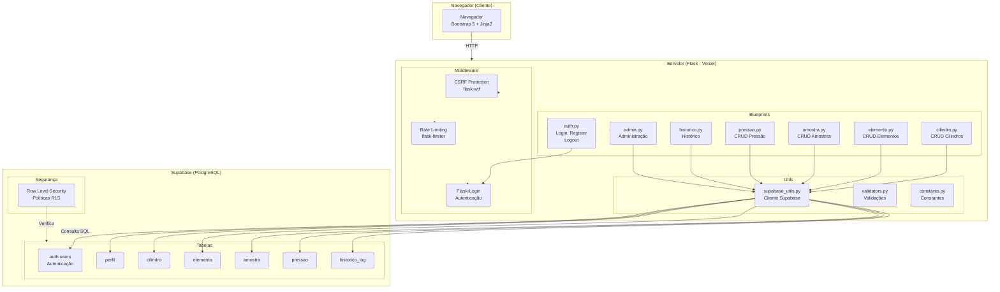
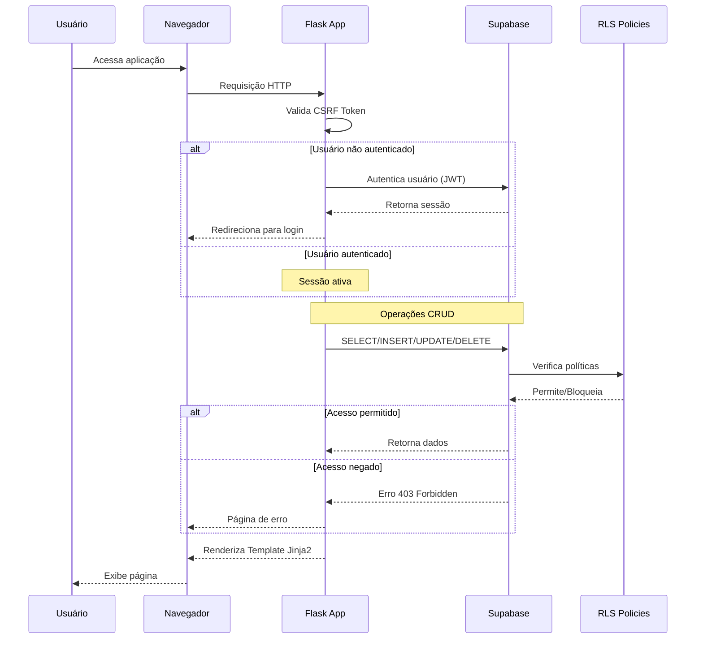
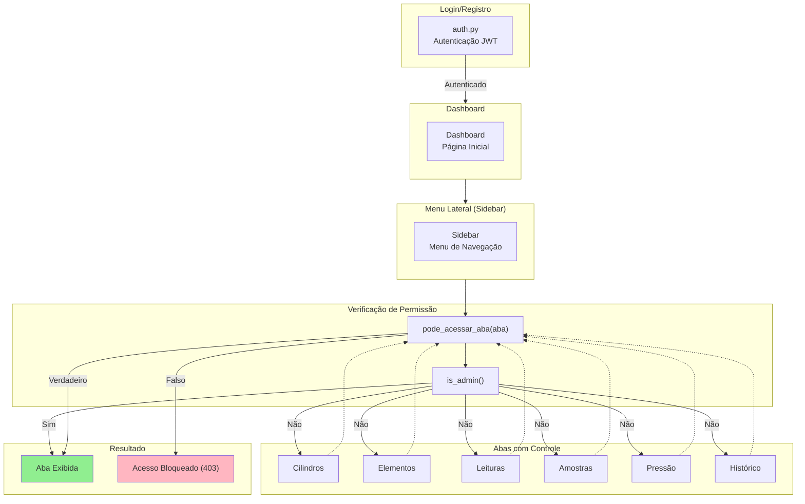
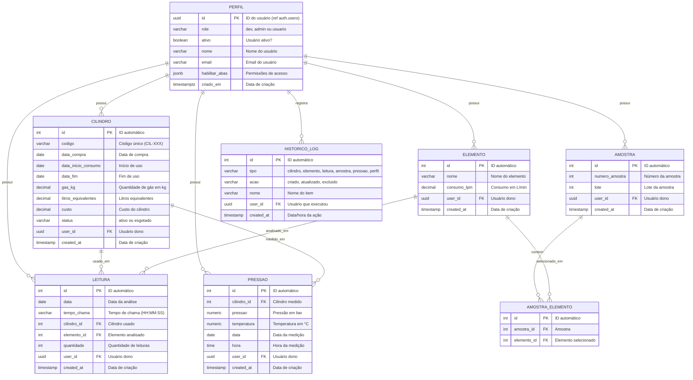

# Sistema de Gestão e Rastreabilidade para Laboratórios Químicos: Uma Abordagem Baseada em Boas Práticas de Laboratório

**Autores:**
- Lucas Cavalcante dos Santos¹
- Thiago Bricio Pinheiro Sandre²

**Afiliações:**
1. Universidade de Fortaleza - UNIFOR
2. Universidade Estadual do Ceará - UECE

**Data:** Junho de 2026

---

## Resumo

O presente trabalho descreve o desenvolvimento e implementação de um sistema web para gestão e rastreabilidade de dados em laboratórios químicos, fundamentado nos princípios das Boas Práticas de Laboratório (BPL). O sistema foi desenvolvido utilizando Flask como framework backend, Jinja2 para templating, Supabase como banco de dados PostgreSQL e tecnologias de autenticação baseadas em JWT. A aplicação contempla o registro completo de cilindros, elementos analisados, leituras, amostras com associação N:N a elementos e medições de pressão, permitindo o acompanhamento do ciclo de vida completo dos insumos laboratoriais. O dashboard analítico fornece métricas essenciais para o controle de qualidade, incluindo 6 indicadores-chave (KPIs) e 4 gráficos interativos. Os resultados demonstram que a digitalização dos processos de coleta de dados, aliados às políticas de segurança Row Level Security (RLS) e controle de acesso baseado em papéis, atende aos requisitos de rastreabilidade e integridade de dados exigidos pela literatura científica e regulamentações aplicáveis.

**Palavras-chave:** Boas Práticas de Laboratório; Sistema de Gestão de Laboratórios; Rastreabilidade; Flask; Supabase; LIMS; Desenvolvimento Web.

---

## 1. Introdução

A qualidade dos resultados analíticos em laboratórios químicos está intrinsecamente vinculada à capacidade de rastreabilidade dos processos, insumos e procedimentos adotados. As Boas Práticas de Laboratório (BPL), também conhecidas internacionalmente como Good Laboratory Practice (GLP), estabelecem um marco regulatório que visa garantir a confiabilidade, integridade e rastreabilidade dos dados gerados em estudos não clínicos (ANVISA, 2009; OECD, 1998).

A rastreabilidade, definida como a capacidade de acompanhar o histórico completo de um dado ou material através de todas as etapas do processo analítico, constitui um dos pilares fundamentais dos sistemas de gestão de qualidade em laboratórios. Esta capacidade permite não apenas a verificação da conformidade dos resultados, mas também a identificação de fontes de erro, a investigação de desvios e a demonstração de confiabilidade frente a auditorias e inspeções regulatórias (ISO, 2017; INMETRO, 2018).

A digitalização dos processos de coleta e armazenamento de dados representa um avanço significativo na busca pela conformidade com as BPL. Os sistemas computadorizados para gestão de informações de laboratório (LIMS - Laboratory Information Management System) têm se tornado ferramentas indispensáveis para laboratórios que buscam eficiência operacional e conformidade regulatória (Allison et al., 2015; Wang et al., 2018). No entanto, a implementação de sistemas comerciais pode representar custos proibitivos para laboratórios de pesquisa acadêmica, demandando soluções personalizadas que equilibrem custo, funcionalidade e facilidade de manutenção.

O presente trabalho propõe o desenvolvimento de um sistema web para gestão e rastreabilidade de dados laboratoriais, destinado especialmente a laboratórios de análise química acadêmicos. O sistema denominado LabGas Manager foi concebido para registrar e monitorar o ciclo de vida completo dos cilindro de gás utilizados em análises, desde sua aquisição até o consumo total, incluindo o registro sistemático das amostras processadas, elementos analisados e medições complementares de pressão e temperatura.

A fundamentação técnica do sistema baseia-se em tecnologias de código aberto, especificamente o framework Flask para desenvolvimento backend, o motor de templates Jinja2 para construção das interfaces web, e o Supabase como plataforma de banco de dados PostgreSQL com autenticação integrada. Esta arquitetura foi escolhida visando facilitar a manutenção, possibilitar customizações futuras e eliminar custos com licenciamento de software.

### 1.1 Objetivos Específicos

- Implementar um sistema de registro digital para cilindros de gás, elementos, leituras, amostras (N:N) e medições de pressão
- Desenvolver um módulo de rastreabilidade que permita consultas históricas completas
- Construir um dashboard analítico com 6 KPIs e 4 gráficos para suporte à tomada de decisão
- Implementar controles de segurança e acesso baseados em papéis (dev, admin, usuario)
- Avaliar a conformidade do sistema com os princípios das Boas Práticas de Laboratório

---

## 2. Fundamentação Teórica

### 2.1 Boas Práticas de Laboratório (BPL)

As Boas Práticas de Laboratório constituem um sistema de qualidade que abrange o processo organizacional e as condições sob as quais estudos de laboratório são planejados, realizados, monitorados, registrados, arquivados e comunicados (OECD, 1998). Este sistema foi inicialmente desenvolvido para atender aos requisitos regulatórios de estudos de segurança química, sendo posteriormente adotado como referência para diversas áreas da química analítica.

Os princípios fundamentais das BPL incluem:

a) Organização e pessoal qualificado
b) Programa de garantia de qualidade
c) Instalações adequadas
d) Equipamentos calibrados e mantidos
e) Reagentes e materiais padronizados
f) Procedimentos operacionais padronizados (POPs)
g) Registro e armazenamento de dados
h) Relatório dos resultados (ANVISA, 2009)

No contexto específico do presente trabalho, os requisitos de maior relevância são aqueles relacionados ao registro e armazenamento de dados, que estabelecem que todas as observações originais, cálculos e documentos devem ser registrados de forma imediata, legível, indelével e à prova de adulteração. Os dados devem incluir a identificação do responsável pela execução e revisão, além de datas de execução das atividades (ISO, 2017).

A rastreabilidade nos processos laboratoriais pode ser compreendida como a documentação cronológica do conjunto de procedimentos que permitem acompanhar a origem, as transformações e o destino de um resultado analítico. Este conceito abrange desde a identificação única de amostras até o registro completo de todos os equipamentos, reagentes e condições ambientais envolvidos na análise (INMETRO, 2018).

### 2.2 Sistemas de Informação para Laboratórios (LIMS)

Os sistemas de gestão de informações de laboratório (LIMS) são aplicações computacionais projetadas para coletar, armazenar, manipular e distribuir informações geradas em ambientes laboratoriais. Estas plataformas desempenham papel crucial na automatização de processos, redução de erros de transcrição e garantia de conformidade regulatória (Allison et al., 2015).

As funcionalidades típicas de um LIMS incluem: gerenciamento de amostras, workflows automatizados de análise, controle de qualidade de resultados, gestão de equipamentos e reagentes, rastreabilidade completa de dados e integração com sistemas de informação corporativa (Wang et al., 2018). A escolha entre soluções comerciais e desenvolvimento próprio deve considerar fatores como orçamento disponível, requisitos específicos do laboratório, capacidade técnica para manutenção e escalabilidade desejada.

Estudos recentes têm demonstrado a crescente adoção de tecnologias web e computação em nuvem para implementação de sistemas LIMS, oferecendo vantagens como acesso remoto, redução de custos de infraestrutura e facilidade de atualizações (Morales et al., 2019). Estas abordagens são particularmente adequadas para laboratórios acadêmicos, onde recursos para manutenção de infraestrutura própria s��o frequentemente limitados.

### 2.3 Tecnologias de Desenvolvimento Web

O desenvolvimento de aplicações web modernas para sistemas de gestão laboratorial baseia-se em arquiteturas cliente-servidor que utilizam protocolos HTTP para comunicação. O backend, responsável pela lógica de negócio e acesso ao banco de dados, pode ser implementado utilizando diversas linguagens de programação e frameworks. O Flask, utilizado no presente trabalho, é um microframework Python que oferece flexibilidade para desenvolvimento de aplicações web de diferentes complexidades (Grinberg, 2017).

O Supabase constitui uma plataforma de backend como serviço (BaaS) que fornece uma instância PostgreSQL gerenciada, com funcionalidades adicionais incluindo autenticação de usuários, APIs RESTful automáticas e políticas de segurança Row Level Security (RLS). Esta tecnologia permite a implementação de sistemas robustos com deployment simplificado e custos previsíveis (Supabase, 2024).

A autenticação baseada em JSON Web Tokens (JWT) representa o padrão recomendado para sistemas web que requerem sessões stateless e segurança escalável. Esta abordagem permite que o servidor valide a identidade do usuário a partir de um token assinado digitalmente, eliminando a necessidade de armazenamento de sessão no servidor (RFC 7519).

---

## 3. Metodologia

### 3.1 Arquitetura do Sistema

O sistema LabGas Manager foi desenvolvido seguindo uma arquitetura MVC (Model-View-Controller) adaptada, utilizando o padrão de rotas baseado em Blueprints do Flask para organização modular do código.



#### Fluxo de Dados do Sistema



O sistema é composto pelos seguintes módulos principais:

| Módulo | Descrição |
|--------|-----------|
| **Autenticação** | Gerencia login, registro, logout e recuperação de sessões com expiração por inatividade (10 minutos) |
| **Cilindros** | Cadastro e controle de cilindros de gás com código único (formato CIL-XXX), data de compra, consumo em kg, litros equivalentes, custo e status |
| **Elementos** | Registro de elementos analisados com consumo em litros por minuto (L/min) |
| **Leituras** | Registro de análises vinculando cilindro, elemento, data, tempo de chama e quantidade |
| **Amostras** | Registro de amostras com associação N:N a elementos, lote e número manual |
| **Pressão** | Registro de medições de pressão (bar) e temperatura (°C) vinculadas a cilindro |
| **Rastreabilidade** | Histórico completo de todas as operações CRUD com registro de usuário, data e tipo de operação |
| **Administrativo** | Painel para gestão de usuários, habilitação de permissões e exportação de dados |
| **Analítico** | Dashboard com 6 KPIs e 4 gráficos interativos |

### 3.2 Fluxo de Abas do Sistema

O sistema LabGas Manager é organizado em um estrutura de abas que proporciona navegação intuitiva e acesso modular às funcionalidades. Cada aba representa um módulo específico do sistema, permitindo aos usuários acessar apenas as ferramentas relevantes às suas atividades.

#### 3.2.1 Abas Disponíveis

O sistema organiza-se em **8 áreas funcionais** acessíveis via menu lateral, sendo **6 delas** passíveis de controle de permissão pelo administrador, e **2 áreas** com acesso livre a todos os usuários autenticados.

##### Abas com Controle de Permissão:

| Aba | Descrição |
|-----|-----------|
| **Cilindros** | Cadastro e controle de cilindros de gás com código único (formato CIL-XXX), status e consumo |
| **Elementos** | Catálogo de elementos analisados com consumo específico em litros por minuto (L/min) |
| **Leituras** | Registro de análises vinculando cilindro, elemento, data, tempo de chama e quantidade |
| **Amostras** | Registro de amostras com associação N:N a elementos, lote e número manual |
| **Pressão** | Medições de pressão (bar) e temperatura (°C) vinculadas a cilindro |
| **Histórico** | Log completo de rastreabilidade com todas as operações CRUD |

##### Áreas de Acesso Livre:

| Área | Descrição |
|------|-----------|
| **Dashboard** | Métricas e gráficos analíticos - visão geral do laboratório com indicadores de desempenho |
| **Perfil** | Edição de dados pessoais e visualização de permissões |

**Nota:** A aba Admin é acessível exclusivamente para usuários com perfil de administrador ou dev (`is_admin()`), sendo controlada pela verificação de role, não pelas permissões de abas.

#### 3.2.2 Fluxo de Navegação

A navegação entre as abas do sistema é realizada através de um **menu lateral (sidebar)**, que exibe dinamicamente apenas as abas permitidas para o usuário logado. O Dashboard funciona como página inicial e ponto central de acesso.



**Descrição do Fluxo:**

1. O usuário autenticado acessa o sistema pelo **Dashboard** (página inicial)
2. O **menu lateral** exibe automaticamente apenas as abas que o usuário tem permissão para acessar
3. Para as abas com controle de permissão (Cilindros, Elementos, Leituras, Amostras, Pressão, Histórico), o sistema verifica `pode_acessar_aba()` antes de permitir acesso
4. Usuários com role **admin** ou **dev** têm acesso irrestrito a todas as abas, incluindo o painel Admin
5. O menu lateral só exibe a opção Admin para usuários com `is_admin()` (admin ou dev)

#### 3.2.3 Sistema de Controle de Permissões

O sistema implementa um **controle de acesso granular** que permite ao administrador gerenciar quais abas cada usuário pode acessar. Esta funcionalidade atende aos requisitos de segurança e confidencialidade das Boas Práticas de Laboratório, garantindo que cada usuário visualize apenas as funcionalidades relevantes às suas atividades.

Apenas 6 abas possuem sistema de controle de permissão:

```json
{
    "cilindro": true,
    "pressao": true,
    "elemento": true,
    "leitura": true,
    "amostra": true,
    "historico": true
}
```

**Características do Controle de Permissões:**

1. **Acesso padrão (default):** Todas as 6 abas controladas são liberadas automaticamente para novos usuários (`true` por padrão)

2. **Controle administrativo:** O usuário com perfil de administrador pode habilitar ou desabilitar o acesso a cada aba individualmente para cada usuário através do painel Admin

3. **Verificação em nível de rota:** Cada blueprint (cilindro.py, elemento.py, amostra.py, pressao.py, historico.py) verifica a permissão antes de processar a requisição

```python
from blueprints.helpers import pode_acessar_aba

@app.route("/cilindros")
def listar_cilindros():
    if not pode_acessar_aba("cilindro"):
        abort(403)  # Acesso proibido
```

4. **Verificação em nível de interface:** O menu lateral (sidebar) também verifica permissões para exibir/esconder os links

```html

    <a href="/cilindros">Cilindros</a>

```

5. **Herança administrativa:** Usuários com perfil de administrador (`role = 'admin'` ou `'dev'`) têm acesso completo a todas as abas, independente das permissões configuradas. A verificação `is_admin()` retorna `True` para ambos antes de verificar as permissões individuais.

6. **Lógica de fallback:** Se o campo `habilitar_abas` for `NULL` no banco de dados, o sistema considera todas as permissões como `True` (acesso permitido)

7. **Visualização no perfil:** O usuário pode visualizar suas permissões atuais na aba Perfil

**Tabela de Resumo:**

| Característica | Descrição |
|--------------|-----------|
| Abas controladas | Cilindros, Pressão, Elementos, Leituras, Amostras, Histórico |
| Abas livres | Dashboard, Perfil |
| Acesso Admin/Dev | Por role (não por permissão de aba) |
| Armazenamento | Campo JSONB na tabela `perfil` |
| Default | `true` para todas as abas |

Esta estrutura de controle de acesso contribui para a conformidade com as BPL, garantindo que apenas pessoal autorizado tenha acesso a informações específicas do laboratório, reforçando a segurança e a integridade dos dados.

### 3.3 Modelo de Dados

O modelo de dados foi implementado no PostgreSQL (via Supabase) com as seguintes tabelas principais:

| Tabela | Descrição |
|--------|-----------|
| `cilindro` | Registro de cilindros de gás com código, data de compra, consumo, custo e status |
| `elemento` | Catálogo de elementos analisados com consumo em L/min |
| `leitura` | Registro de análises vinculando cilindro, elemento, data, tempo de chama e quantidade |
| `amostra` | Registro de amostras com associação N:N a elementos, lote e número manual |
| `amostra_elemento` | Tabela pivô da relação N:N entre amostras e elementos |
| `pressao` | Medições de pressão e temperatura vinculadas a cilindro |
| `perfil` | Perfis de usuários com role (dev/admin/usuario), status e permissões por módulo |
| `historico_log` | Registro de todas as operações para fins de rastreabilidade |

#### Schema do Banco de Dados (ER Diagram)



As tabelas `cilindro`, `elemento`, `leitura`, `amostra` e `pressao` contêm o campo `user_id` que estabelece o vínculo com o usuário proprietário do registro, garantindo o isolamento de dados entre diferentes usuários do sistema.

#### Índices do Banco de Dados

| Tabela | Índice | Coluna(s) | Propósito |
|--------|--------|-----------|-----------|
| cilindro | idx_cilindro_user_id | user_id | Filtrar por usuário |
| cilindro | idx_cilindro_codigo | codigo | Busca por código |
| elemento | idx_elemento_user_id | user_id | Filtrar por usuário |
| elemento | idx_elemento_nome | nome | Busca por nome |
| leitura | idx_leitura_user_id | user_id | Filtrar por usuário |
| leitura | idx_leitura_cilindro_id | cilindro_id | Vincular cilindro |
| leitura | idx_leitura_elemento_id | elemento_id | Vincular elemento |
| leitura | idx_leitura_data | data | Filtrar por data |
| amostra | idx_amostra_user_id | user_id | Filtrar por usuário |
| amostra | idx_amostra_lote | lote | Busca por lote |
| amostra | idx_amostra_lote_created | lote, created_at DESC | Lotes + ordenação |
| amostra_elemento | idx_amostra_elemento_amostra_id | amostra_id | Vincular amostra |
| amostra_elemento | idx_amostra_elemento_elemento_id | elemento_id | Vincular elemento |
| pressao | idx_pressao_user_id | user_id | Filtrar por usuário |
| pressao | idx_pressao_cilindro_id | cilindro_id | Vincular cilindro |
| pressao | idx_pressao_data | data | Filtrar por data |
| historico_log | idx_historico_log_user_id | user_id | Filtrar por usuário |
| historico_log | idx_historico_log_tipo | tipo | Filtrar por tipo |
| historico_log | idx_historico_log_created_at | created_at | Ordenação temporal |

#### Políticas RLS (Row Level Security)

| Tabela | SELECT | INSERT | UPDATE | DELETE |
|--------|--------|--------|--------|--------|
| cilindro | Público (todos) | Próprio usuário | Próprio usuário | Próprio usuário |
| elemento | Público (todos) | Próprio usuário | Próprio usuário | Próprio usuário |
| leitura | Público (todos) | Próprio usuário | Próprio usuário | Próprio usuário |
| amostra | Público (todos) | Próprio usuário | Próprio usuário | Próprio usuário |
| amostra_elemento | Público (todos) | Próprio usuário | Próprio usuário | Próprio usuário |
| perfil | Próprio usuário | Próprio usuário | Próprio usuário | - |
| pressao | Público (todos) | Próprio usuário | Próprio usuário | Próprio usuário |
| historico_log | Público (todos) | Admin (service_role) | - | - |

### 3.4 Controle de Segurança e Auditoria

O sistema implementa múltiplas camadas de segurança para proteção dos dados e conformidade com requisitos de integridade:

1. **Hierarquia de Roles (3 níveis)** — `dev` (super-admin, bypass RLS), `admin` (gestão de usuários + exportação, respeita RLS nos dados), `usuario` (acesso apenas aos próprios dados)
2. **Autenticação JWT** - Validação de identidade através de tokens assinados digitalmente
3. **Políticas RLS** - O PostgreSQL aplica automaticamente políticas de Row Level Security que restringem o acesso aos dados apenas ao proprietário do registro
4. **Proteção CSRF** - Token anti-Cross-Site Request Forgery em todos os formulários
5. **Rate Limiting** - Limite de tentativas de login (5/min) e registro (3/min)
6. **Validação de Entrada** - Sanitização e validação de todos os dados recebidos
7. **Expiração de Sessão** - Sessões expiram após 10 minutos de inatividade

#### 3.4.1 Sistema de Auditoria e Registro de Log

O sistema possui um módulo completo de auditoria que registra todas as operações realizadas, garantindo a rastreabilidade exigida pelas Boas Práticas de Laboratório. A tabela `historico_log` armazena os seguintes campos:

| Campo | Descrição |
|-------|-----------|
| tipo | Tipo de registro (cilindro, elemento, amostra, pressao, perfil) |
| ação | Operação realizada (criado, atualizado, excluido) |
| nome | Identificação do registro afetado |
| user_id | ID do usuário que realizou a operação |
| created_at | Data e hora da operação |

**Eventos Registrados por Módulo:**

| Módulo | Eventos Registrados |
|--------|---------------------|
| Cilindro | Criado, atualizado, excluido |
| Elemento | Criado, atualizado, excluido |
| Leitura | Criado, atualizado, excluido |
| Amostra | Criado, atualizado, excluido |
| Pressão | Criado, atualizado, excluido |
| **Perfil** | **Criado (cadastro), atualizado (role, permissões, status)** |

**Log de Eventos de Usuários:**

O sistema registra automaticamente os seguintes eventos relacionados a usuários:

- **Cadastro de novo usuário:** Registrado no momento da criação da conta, incluindo email e dados do perfil inicial
- **Alteração de role:** Quando um administrador promove ou rebaixa um usuário para admin/usuário
- **Ativação/Desativação:** Quando um administrador bloqueia ou liberta o acesso de um usuário
- **Permissões de abas:** Quando um administrador altera as permissões de acesso às abas do sistema

Esta funcionalidade de auditoria permite:
- Reconstrução completa da história de qualquer registro
- Identificação do responsável por cada opera��ão
- Investigação de desvios e inconsistências
- Conformidade com requisitos de auditoria das BPL

---

## 4. Resultados e Discussão

### 4.1 Funcionalidades Implementadas

O sistema desenvolvido contempla todas as funcionalidades planejadas, organizadas em módulos que atendem aos requisitos de rastreabilidade e controle de qualidade. A interface web foi construída utilizando Bootstrap 5, garantindo responsividade e acessibilidade em diferentes dispositivos.

**Módulo de Cilindros:** Permite o cadastro completo de cada unidade, incluindo código identificador único (CIL-001, CIL-002, etc.), data de compra, data de início de consumo, quantidade de gás em kg, litros equivalentes (considerando a conversão de 1 kg = 956 L para o gás padrão), custo de aquisição e status operacional. O sistema impede a duplicação de códigos por usuário e oferece filtros para busca por código ou status.

**Módulo de Elementos:** Registra os elementos químicos analisados no laboratório, com cadastro automático de 20 elementos padrão comuns (Alumínio, Cálcio, Ferro, Magnésio, entre outros). Cada elemento possui um consumo específico em litros por minuto, informação essencial para o cálculo de eficiência dos cilindro.

**Módulo de Leituras:** Constitui o registro central das análises realizadas. Cada leitura é vinculada a um cilindro e um elemento específicos, com registro de data, tempo de chama (formato HH:MM:SS) e quantidade de leituras. O sistema impede a exclusão de cilindros ou elementos que possuam leituras vinculadas, preservando a integridade referencial.

**Módulo de Amostras (N:N):** Gerencia amostras com associação muitos-para-muitos a elementos via tabela `amostra_elemento`. Cada amostra possui número manual (real positivo), lote e pode conter múltiplos elementos simultaneamente. O módulo inclui sugestão de lotes via `<datalist>`, paginação padronizada e validação de pelo menos um elemento por amostra.

**Módulo de Pressão:** Permite o registro sistemático de medições de pressão (em bar) e temperatura (em °C) associadas a cada cilindro. Esta funcionalidade atende à necessidade de monitoramento das condições de armazenamento e uso dos gases, conforme exigido pelas BPL.

**Módulo de Histórico (Rastreabilidade):** Registra todas as operações realizadas no sistema, incluindo tipo de operação (criado, atualizado, excluído), identificação do elemento afetado, usuário responsável e data/hora da operação. Este módulo permite a reconstrução completa da história de qualquer registro, essencial para investigações de desvios e auditorias.

**Log de Usuários:** Além das operações de dados laboratoriais, o sistema registra eventos relacionados a usuários no histórico:

- **Cadastro de novo usuário:** Registrado automaticamente ao criar conta (tipo: perfil, ação: criado)
- **Alteração de role:** Quando o admin promove/rebaixa um usuário (tipo: perfil, ação: atualizado)
- **Ativação/Desativação:** Quando o admin bloqueia/libera acesso de usuário (tipo: perfil, ação: atualizado)
- **Permissões de abas:** Quando o admin altera acesso às abas do sistema (tipo: perfil, ação: atualizado)

### 4.2 Dashboard Analítico

O dashboard foi reestruturado para fornecer 6 indicadores-chave (KPIs) e 4 gráficos interativos, organizados em 4 linhas:

#### Layout do Dashboard

```
LINHA 1 — 6 KPI Cards
┌──────────┬──────────┬──────────┬─────────┬──────────┬─────────┐
│Cilindros │ Gás      │ Leituras │Amostras │Custo/    │ Gás     │
│ Ativos   │ Restante │ Totais   │ Totais  │Leitura   │Consumido│
└──────────┴──────────┴──────────┴─────────┴──────────┴─────────┘

LINHA 2 — Gráficos Principais
┌────────────────────────────────────┬──────────────────────────┐
│ Curva de Pressão por Cilindro     │ Leituras por Mês        │
│ (line chart, multicolor)          │ (bar chart, 12 meses)   │
└────────────────────────────────────┴──────────────────────────┘

LINHA 3 — Análise
┌────────────────────────────────────┬──────────────────────────┐
│ Leituras por Cilindro (doughnut)  │ Elementos por Amostra   │
│ (intensidade por rank)            │ (bar chart, distribuição)│
└────────────────────────────────────┴──────────────────────────┘

LINHA 4 — Atividade Recente
┌──────────────────┬──────────────────┬─────────────────────────┐
│ Elementos mais   │ Últimas Leituras │ Últimas Amostras       │
│ Analisados (Top5)│ (5 recentes)     │ (5 recentes)           │
└──────────────────┴──────────────────┴─────────────────────────┘
```

#### KPIs (Linha 1)

| KPI | Fórmula | Exemplo | Propósito |
|-----|---------|---------|-----------|
| **Cilindros Ativos** | `COUNT(cilindro WHERE status = "ativo")` | 3 | Quantos cilindros estão em uso |
| **Gás Restante** | `Σ(litros_equivalentes - gas_consumido)` por cilindro ativo | 845L | Quanto gás ainda pode ser utilizado |
| **Leituras Totais** | `Σ(quantidade)` de todas as leituras | 127 | Total de análises realizadas |
| **Amostras Totais** | `COUNT(amostra)` | 24 | Total de amostras cadastradas |
| **Custo/Leitura** | `Σ(custo dos cilindros) ÷ Σ(quantidade das leituras)` | R$ 4,57 | Custo médio por análise |
| **Gás Consumido** | `Σ(minutos_de_chama ÷ 60 × consumo_lpm)` | 112L | Total de gás já consumido |

O cálculo de **Gás Consumido** considera cada leitura: o tempo de chama (HH:MM:SS) é convertido para minutos e multiplicado pelo consumo do elemento (L/min). O **Gás Restante** subtrai o consumido dos litros equivalentes de cada cilindro ativo. O **Custo/Leitura** é uma estimativa baseada no custo total dos cilindros dividido pelo total de leituras.

#### Gráficos (Linhas 2 e 3)

**Curva de Pressão por Cilindro** — gráfico de linha que mostra a evolução da pressão (bar) ao longo do tempo para cada cilindro. Cada cilindro ganha uma cor diferente da paleta rainbow. O sistema coleta as últimas 10 medições de pressão de cada cilindro ativo, permitindo visualizar o decaimento natural do gás.

**Leituras por Mês** — gráfico de barras que agrupa as leituras por mês nos últimos 12 meses. O eixo X exibe os meses em português (Jan 2026, Fev 2026, etc.), o eixo Y é a soma das quantidades. Essencial para enxergar sazonalidade no laboratório.

**Leituras por Cilindro** — gráfico de rosca (doughnut) que mostra a distribuição de leituras entre cilindros. As cores variam por intensidade conforme o rank de uso (mais usado = cor mais escura), utilizando o sistema de paletas rainbow de 5 níveis.

**Elementos por Amostra** — gráfico de barras que mostra a distribuição de quantos elementos cada amostra possui (1, 2, 3, 4+ elementos). Ajuda a entender a complexidade média das amostras registradas no laboratório.

#### Sistema de Cores Rainbow v3.0

O dashboard utiliza um esquema de cores **rainbow ordenado por dependência** entre entidades:

| Entidade | Relação | Cor | Hex |
|----------|---------|-----|-----|
| Cilindro | Raiz, base de medições | Vermelho | `#e63946` |
| Pressão | Depende de Cilindro | Laranja | `#f77f00` |
| Elemento | Raiz, base de análises | Verde | `#2a9d8f` |
| Leitura | Depende de Cilindro + Elemento | Azul | `#457b9d` |
| Amostra | N:N com Elementos | Violeta | `#6a1b9a` |

Cada entidade possui uma paleta de **5 níveis claro→escuro** para os gráficos Chart.js. A função `getColorByIntensity()` mapeia o rank do valor para a cor correspondente: valores baixos recebem cores claras, valores altos recebem cores escuras.

Os botões de ação e sinalização (primary, danger, success, warning) mantêm as cores padrão do Bootstrap, não sendo modificados pelo sistema rainbow.

#### Cache e Performance

As métricas são cacheadas com diferentes TTLs: **30 segundos** para KPIs (consultas frequentes), **5 minutos** para listagens de dados e **300 segundos** para lista de usuários. O cache é invalidado automaticamente via `invalidate_user_caches(user_id)` após qualquer CREATE, UPDATE ou DELETE em todos os blueprints, garantindo que os dados exibidos sejam sempre atuais.

### 4.3 Sistema de Administração

O módulo administrativo permite a gestão completa de usuários, incluindo:

- Listagem de todos os usuários cadastrados com estatísticas de uso
- Ativação e desativação de acesso de usuários
- Promoção e rebaixamento de funções (administrador/usuário)
- Exclusão de usuários com remoção cascade de todos os dados associados
- Controle granular de permissões por módulo (habilitar/desabilitar acesso a Cilindros, Elementos, Leituras, Amostras, Pressão, Histórico)
- Exportação de dados em múltiplos formatos (JSON, CSV, Excel, Markdown)

As funcionalidades de exportação são especialmente úteis para geração de relatórios conforme exigido pelas BPL, permitindo a extração de dados para auditorias e análises externas.

### 4.4 Conformidade com Boas Práticas de Laboratório

A avaliação do sistema em relação aos requisitos das BPL demonstra conformidade em vários aspectos fundamentais:

| Requisito BPL | Implementação no Sistema |
|--------------|-------------------------|
| Registro imediato | Entrada de dados direto no sistema sem papel intermediário |
| Identificação do responsável | Registro automático de user_id em todas as operações |
| Rastreabilidade | Histórico completo de CRUD com timestamp e usuário |
| Dados à prova de adulteração | RLS + log de auditoria + backup diário Cloudflare R2 + GitHub Actions |
| Arquivamento | Dados persistidos em PostgreSQL com políticas de retenção |
| Controle de acesso | Autenticação JWT + permissões por perfil + Rate Limiting |
| Validação de dados | Validações server-side + Constraints PostgreSQL |
| Equipamentos calibrados | Registro de pressão e temperatura com data/hora |
| Procedimentos padronizados | POPs documentados no sistema via interface |

A implementação de políticas Row Level Security (RLS) no PostgreSQL garante que cada usuário visualize apenas os seus próprios registros, impedindo acesso não autorizado a informações de outros usuários. Esta funcionalidade é particularmente importante em ambientes compartilhados onde múltiplos pesquisadores utilizam o mesmo sistema.

O sistema de log de histórico (`historico_log`) atende diretamente ao requisito de rastreabilidade das BPL, permitindo responder às perguntas: quem fez o quê, quando e em qual registro. Cada operação de criação, atualização ou exclusão gera um registro automático no histórico, com as informações necessárias para reconstrução da cadeia de custódia dos dados.

A expiração de sessão após 10 minutos de inatividade adiciona uma camada de segurança, impedindo acesso não autorizado quando o usuário deixa a estação de trabalho sem realizar logout. Esta prática é recomendada em ambientes laboratoriais onde múltiplos pesquisadores compartilham equipamentos.

---

## 5. Conclusão

O presente trabalho apresentou o desenvolvimento e implementação do sistema LabGas Manager, uma plataforma web para gestão e rastreabilidade de dados em laboratórios químicos. O sistema foi fundamentado nos princípios das Boas Práticas de Laboratório (BPL), buscando atender aos requisitos de confiabilidade, integridade e rastreabilidade dos dados gerados em análises químicas.

A arquitetura técnica baseada em Flask, Jinja2 e Supabase demonstrou-se adequada para as funcionalidades planejadas, oferecendo desenvolvimento simplificado, manutenção facilitada e custos operacionais reduzidos. A utilização de tecnologias de código aberto elimina dependências de licenciamento, tornando a solução acessível para laboratórios acadêmicos com recursos limitados.

Os resultados obtidos demonstram que o sistema atende aos requisitos funcionais e de segurança planejados, incluindo: registro completo de cilindro de gás, elementos, amostras e medições; rastreabilidade total das operações; dashboard analítico para suporte à decisão; controle de acesso baseado em funções; e exportação de dados em múltiplos formatos.

A conformidade com os princípios das Boas Práticas de Laboratório foi verificada, destacando-se:

- O registro imediato de dados sem uso de papel intermediário
- A identificação automática do responsável por cada operação
- A rastreabilidade completa através do módulo de histórico
- O controle de acesso com autenticação JWT e políticas RLS
- A proteção contra adulteração através de múltiplas camadas de segurança

### 5.1 Trabalhos Futuros

- Implementação de validação de resultados com alertas de desvio
- Integração com equipamentos analíticos para coleta automática de dados
- Geração automática de relatórios em formatos padronizados
- Implementação de módulos adicionais para gestão de reagentes e controle de qualidade interno

---

## Referências

### Legislação e Normas

- ANVISA. **Boas Práticas de Laboratório de Controle de Qualidade de Produtos para Saúde**. Agência Nacional de Vigilância Sanitária, 2009.

- OECD. **OECD Principles on Good Laboratory Practice (Revised 1997)**. Organisation for Economic Co-operation and Development, 1998. (OECD Series on Principles of Good Laboratory Practice and Compliance Monitoring, No. 1)

- ISO. **ISO/IEC 17025:2017 - Requisitos gerais para a competência de ensaios e calibrações**. International Organization for Standardization, 2017.

- INMETRO. **Critérios de Credenciamento de Laboratórios de Ensaios e Calibrações**. Instituto Nacional de Metrologia, Qualidade e Tecnologia, 2018.

### LIMS e Sistemas de Informação

- Allison, J.; Jankowski, M.; Massey, S. **Laboratory Information Management Systems: A Review**. Analytical Chemistry, v. 87, n. 12, p. 5784-5794, 2015.

- Wang, L.; Bazeley, J. **Modern LIMS: The Digital Backbone of the Modern Laboratory**. Journal of Laboratory Automation, v. 23, n. 1, p. 52-63, 2018.

- Morales, M.; Chen, J.; Williams, R. **Cloud-based Laboratory Information Management Systems: A Review**. Trends in Analytical Chemistry, v. 116, p. 230-237, 2019.

### Desenvolvimento Web e Tecnologias

- Grinberg, M. **Flask Web Development: Developing Web Applications with Python**. 2. ed. O'Reilly Media, 2017.

- Supabase. **Supabase: The Open Source Firebase Alternative**. 2024. Disponível em: https://supabase.com

- Jones, M.; Bradley, J.; Sakimura, N. **RFC 7519 - JSON Web Token (JWT)**. Internet Engineering Task Force (IETF), 2015.

- Lima, E. C. P. **Python para Desenvolvedores**. 4. ed. Novatec, 2019.

- Python Software Foundation. **The Python Standard Library**. 2024. Disponível em: https://docs.python.org/3/

### Banco de Dados e Segurança

- PostgreSQL Global Development Group. **PostgreSQL Documentation**. 2024. Disponível em: https://www.postgresql.org/docs/

- Stonebraker, M.; Brown, P.; Zhang, D. **The land of the PostgreSQL RDBMS**. IEEE Data Engineering Bulletin, v. 39, n. 1, p. 21-30, 2016.

- Hardt, D. **RFC 6749 - The OAuth 2.0 Authorization Framework**. Internet Engineering Task Force (IETF), 2012.

### Qualidade em Laboratórios

- Starosta, V.; Ribeiro, C. A. F. **Introdução às Boas Práticas de Laboratório**. Editora Santos, 2018.

- Silva, J. R.; Oliveira, A. C. **Rastreabilidade Analítica: Conceitos e Aplicações**. Química Nova, v. 40, n. 2, p. 224-231, 2017.

- Skoog, D. A.; Holler, F. J.; Crouch, S. R. **Fundamentos de Química Analítica**. 10. ed. Cengage Learning, 2019.

### Desenvolvimento de Software

- Sommerville, I. **Engenharia de Software**. 10. ed. Pearson, 2019.

- Pressman, R. S.; Maxim, B. R. **Engenharia de Software: Uma Abordagem Profissional**. 9. ed. McGraw-Hill, 2021.

### Apresentação de Dados

- Lavagnini, I.; Magno, F.; Seraglia, R. **Statistical Methods in Analytical Chemistry**. Data Analysis in Analytical Chemistry. Academic Press, 2020.

---

**Repositório do Projeto:** https://github.com/cavalcanteprofessional/labgas-manager

---

*Artigo desenvolvido em Junho de 2026*